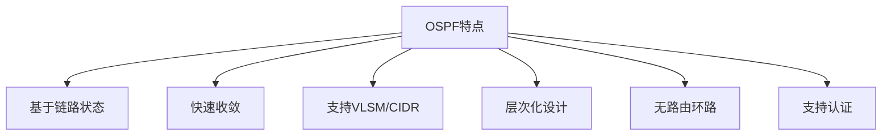
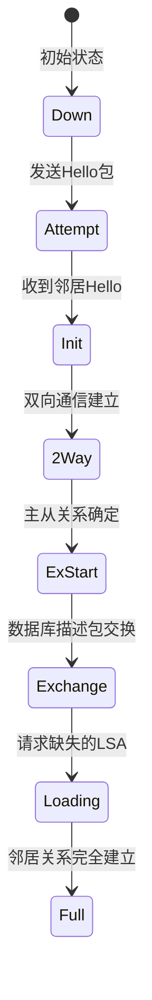
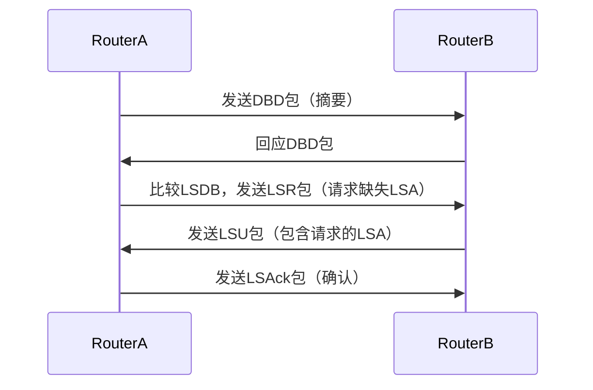
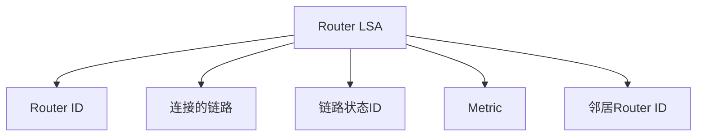
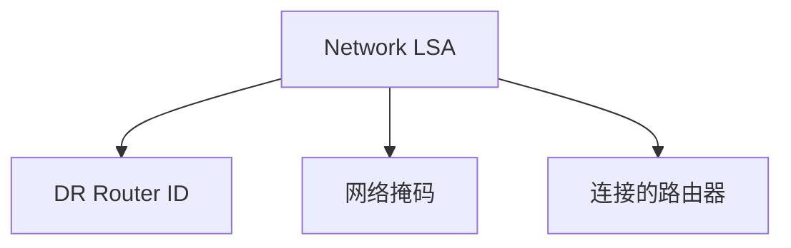
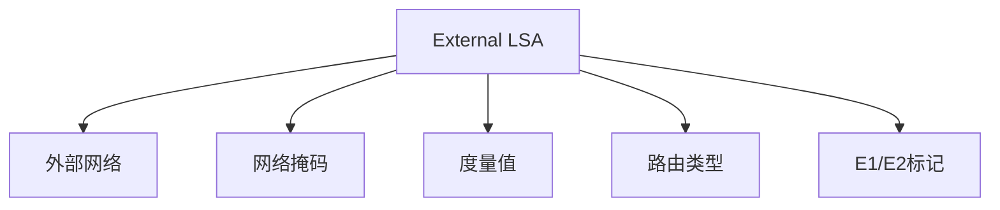

# OSPF协议详解：开放最短路径优先路由协议

OSPF（Open Shortest Path First，开放最短路径优先）是一种基于链路状态的路由协议，广泛应用于大型企业网络和互联网服务提供商网络。本文将详细介绍OSPF的工作原理、协议协商流程、LSA类型及其在路由计算中的作用。

## 一、OSPF基础概念

### 1.1 协议特点



### 1.2 OSPF区域结构

OSPF采用层次化设计，将网络划分为不同的区域：

```
+-------------------+
|     Area 0        |  <-- 根区域/骨干区域
+-------------------+
| Area 1            |
| Area 2            |
| ...              |
+-------------------+
```

## 二、OSPF协议协商流程

### 2.1 邻居关系建立过程

OSPF邻居关系的建立需要经过多个状态：



### 2.2 Hello协议详解

邻居发现和维护通过Hello包实现：

```python
# OSPF Hello包结构示例
class OSPFHelloPacket:
    def __init__(self):
        self.version = 2          # OSPF版本
        self.type = 1            # Hello包类型
        self.packet_length = 0
        self.router_id = "192.168.1.1"
        self.area_id = "0.0.0.0"
        self.auth_type = 0
        self.hello_interval = 10  # Hello间隔（秒）
        self.options = 0x02      # E位（外部路由）
        self.router_dead_interval = 40
        self.designated_router = "0.0.0.0"
        self.backup_designated_router = "0.0.0.0"
        self.neighbors = []      # 已知的邻居列表
```

### 2.3 数据库同步过程

邻居关系建立后，路由器需要同步链路状态数据库：



## 三、LSA类型及其作用

### 3.1 LSA类型概述

OSPF使用多种LSA类型来传播不同类型的信息：

| LSA类型 | 名称 | 作用 | 传播范围 |
|---------|------|------|----------|
| 1 | 路由器LSA | 描述路由器接口状态 | 区域内 |
| 2 | 网络LSA | 描述多访问网络 | 区域内 |
| 3 | 汇总LSA | 汇总区域外路由 | 区域间 |
| 4 | ASBR汇总LSA | 汇总ASBR位置 | 区域间 |
| 5 | 外部LSA | 外部路由信息 | 整个OSPF域 |
| 7 | NSSA外部LSA | 在NSSA区域内传播外部路由 | NSSA区域 |

### 3.2 各类LSA详解

#### 3.2.1 路由器LSA（Type 1）



**示例：**

```
Type: 1 (Router LSA)
Link State ID: 192.168.1.1
Advertising Router: 192.168.1.1
LS Sequence Number: 0x80000003
LS Checksum: 0x1234
Length: 48
Number of Links: 2

Link ID: 192.168.1.1 (Router ID)
Link Data: 0.0.0.0
Type: 1 (Point-to-Point)
Metric: 1
ToS: 0
Link ID: 192.168.1.2
Link Data: 192.168.1.2
Type: 1 (Point-to-Point)
Metric: 1
ToS: 0
```

#### 3.2.2 网络LSA（Type 2）

用于描述多访问网络（如以太网）：



#### 3.2.3 汇总LSA（Type 3）

将区域外路由信息汇总到其他区域：

```python
# Type 3 LSA示例
class SummaryLSA:
    def __init__(self):
        self.network_mask = "255.255.255.0"
        self.metric = 10
        self.tos = 0
        self.forwarding_address = "0.0.0.0"
        self.external_route_tag = 0
```

#### 3.2.4 外部LSA（Type 5）

引入外部路由（如静态路由、BGP路由）：



## 四、SPF算法与路由计算

### 4.1 SPF算法原理

OSPF使用Dijkstra最短路径优先算法计算路由：

```python
def dijkstra_algorithm(graph, source):
    # 初始化距离字典
    distances = {node: float('infinity') for node in graph}
    distances[source] = 0
    visited = set()

    while len(visited) < len(graph):
        # 找到未访问节点中距离最小的
        current_node = min(
            (node for node in graph if node not in visited),
            key=lambda node: distances[node]
        )

        visited.add(current_node)

        # 更新邻居距离
        for neighbor, weight in graph[current_node].items():
            if neighbor not in visited:
                new_distance = distances[current_node] + weight
                if new_distance < distances[neighbor]:
                    distances[neighbor] = new_distance

    return distances
```

### 4.2 路由计算过程

1. **构建拓扑图**：从LSDB中提取所有链路状态信息
2. **运行SPF算法**：计算到每个目的地的最短路径
3. **生成路由表**：根据最短路径构建路由表


### 4.3 路由类型

OSPF根据来源不同将路由分为不同类型：

| 路由类型 | 优先级 | 描述 |
|---------|--------|------|
| Intra-area | 10 | 区域内路由 |
| Inter-area | 20 | 区域间路由 |
| External Type 1 | 150 | 外部类型1路由 |
| External Type 2 | 160 | 外部类型2路由 |

## 五、OSPF配置示例

### 5.1 基本配置

```bash
# Cisco IOS配置示例
router ospf 1
 router-id 1.1.1.1
 network 192.168.1.0 0.0.0.255 area 0
 network 10.0.0.0 0.0.0.255 area 1
 area 0 authentication message-digest
 area 1 stub
```

### 5.2 路由重分布

```bash
# 将BGP路由重分布到OSPF
router ospf 1
 redistribute bgp 65001 metric 20 metric-type 1 subnets
```

## 六、OSPF故障排除

### 6.1 常见问题

| 问题 | 可能原因 | 解决方法 |
|------|----------|----------|
| 邻居关系无法建立 | Hello间隔不匹配 | 统一Hello间隔 |
| 路由不收敛 | LSA泛洪问题 | 检查区域配置 |
| 路由选择错误 | 度量值配置不当 | 调整metric值 |

### 6.2 调试命令

```bash
# Cisco IOS调试命令
show ip ospf neighbor      # 查看邻居状态
show ip ospf database     # 查看LSDB
show ip route ospf        # 查看OSPF路由
debug ip ospf adj         # 调试邻居关系
debug ip ospf events      # 调试OSPF事件
```

## 七、总结

OSPF作为一种强大的链路状态路由协议，具有以下优势：

1. **快速收敛**：使用SPF算法快速计算最短路径
2. **无路由环路**：通过层次化设计和SPF算法避免环路
3. ** scalability**：支持VLSM/CIDR和区域划分
4. **安全性**：支持多种认证机制

理解OSPF的工作原理对于网络工程师来说至关重要，特别是在设计和维护大型企业网络时。

## 参考资源

1. [RFC 2328 - OSPF Version 2](https://tools.ietf.org/html/rfc2328)
2. [Cisco OSPF Configuration Guide](https://www.cisco.com/c/en/us/td/docs/ios/iproute_ospf/configuration/12-4t/iroc-12-4t-book/iroc-ospf.html)
3. [OSPF Design Guide](https://www.cisco.com/c/en/us/support/docs/ip/open-shortest-path-first-ospf/7039-1.html)