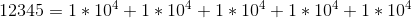
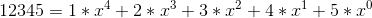
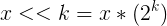
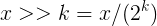

# CSAPP第二章(1)

许多操作系统使用8位的块作为最小可寻址内存单元，我们把内存看做一个很大的数组，最小可寻址单元的大小就是一个数组成员的大小。  

#### 进制数转换

在机器的世界里，都是由一个一个位组成的，也就是bit，每一个位由两种状态（0/1），也就是说计算机的世界里所有的信息都是二进制的，我们现实中所有的信息都是可以转换成二进制来表示的。  
由于我们系统是按照8位作为一个单元的，一个单元就可以用两个十六进制数来表示，这样更加方便进行保存信息。  
常见的进制转换有:  
二进制与十六进制之间的转换：

四位二进制→一位十六进制  
一位十六进制→四位二进制

二进制与八进制之间的转换：  

三位二进制→一位八进制  
一位八进制→三位二进制

当然这其中的进制之间的转换过程都离不开我们十进制的参与，八进制中0~7对应的就是十进制的0~7，十六进制的0~f就是对应着十进制的0~15。其他进制数与十进制数的转换其实也是很简单的。  
类比十进制的：  
  

x进制数12345有:  
  

反过来十进制转换其他进制用十进制数除以进制基数不停的取余数，先得到的余数是低位后得到的余数是高位的规则进行将余数排列，即得到了其他进制数。  

#### 字数据大小
每个机器都有一个字长，用来指明指针数据的标称大小。简单的说，就是内存这个大数组的数组下标的最大值。虚拟地址就是按照这个来进行设定空间的最大大小的，虚拟地址的范围是0~2^w-1。  
目前主流的是32位字长机器和64位字长机器。大多数64位机器可以运行32位机器编译的程序。  
编译方式：  
```
linux> gcc -m32 prog.c
```  
这样的程序可以在32位或64位机器上运行。如使用下指令编译：  
```
linxu> gcc -m64 prog.c
```  
这样的程序只能在64位机器上运行。
对于数据类型，就会受机器字长的影响，如下表：

有符号|无符号|32|64  
---|---|---|---| 
(signed)char|unsigned char|1|1
short|unsigned short|2|2
int|unsigned int|4|4
long|unsigned long|4|8
int32_t|uint32_t|4|4
int64_t|uint64_t|8|8
char *| |4|8
float| |4|4
double| |8|8

#### 数据保存
数据在磁盘上保存的时候是有大小端区别的，什么是大小端呢？  
我们都知道最小寻址单元是一个字节，如果我是两个字节的数据0x1234，那么在磁盘上或者内存上怎么存？是|12|34| 还是|34|12|？这两种方式就是大小端模式。简单来说就是低位数据放在小地址的存储方式是小端存储，高位数据放在小地址的存储方式是大端存储。如果地址从左到右递增，对应上面的例子就是|12|34|是大端存储，|34|12|是小端存储。  
如何判断系统是大端还是小段呢？我们可以写一个简单的程序来进行判断：


    #include <stdio.h>
    
    int main()
    {
        union {
        int i,
        char c
        } u;
        u.i = 1;
        if(u.i == u.c)
            printf("小端模式")；
        else
            printf("大端模式")；
        return 0；
    }

*union 数据有共同的起始地址，起始地址是最小的地址*

#### 布尔代数

二进制值是计算机编码、存储、和操作信息的核心，围绕数值0和1的研究已经演化出丰富的数学知识体系。这个研究是 **乔治 · 布尔** 的主要工作，因此称为**布尔代数** 。  
布尔代数将0和1分别对应false和true。布尔运算主要有**与、或、非、异或**对应的符号分别是 **"& | ~ ^"** 具体的运算方式如下：  
**与**：两个布尔数全为真时结果为真，否则为假。  
**或**：两个布尔数全为假时结果为假，否则为真。  
**非**：一个布尔数为假时结果为真，为真时结果为假。  
**异或**：两个布尔数相同时为假，不同时为真。  
位向量的运算就是将两个向量的对应位进行上面的四种运算，也就是我们所说的按位运算。

#### C语言中的位运算
C语言中的位运算需要两个数据类型一样的无符号整数进行操作，就是将两个数值对应位进行布尔运算，得到一个相同类型的数据。

#### C语言中的逻辑运算
逻辑运算的结果是布尔值，将两个数据先按规则转换成布尔值，然后进行布尔运算。这个规则是0值为false，其他值为true。
#### C语言中的移位运算

移位运算就是将数据的整体向左或右移动几个位。向左移k位，就是将最左边k位丢弃，最右补k个0，向右移k位就是将最右边k位丢弃，最左补k个0。  
左移对应的数学运算是乘与2，移几位就是乘几个2，右移是除以2，移动几位就除以几个2，对应数学公式如下：  
  


*未完待续。。。*