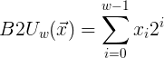
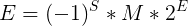

# CSAPP第二章(2)  
  
上一章学习了二进制数与其他进制数之间的转换还有数字在计算机里的存储方式，接下来了解数据的编码格式等知识点。  
#### 原码、反码、补码
在这之前先了解一下 原码、反码、补码的基础知识。  
原码就是一个整数二进制表示，比如15转换成二进制就是**1111**，15的原码就是**1111**。  
反码是在原码的基础上进行按位取反，比如数字11，原码是**1011**，其反码就是按位取反得到**0100**。  
补码是在反码的基础上加上1，比如数字11，原码是**1011**，反码是**0100**，那么其补码就是**0101**。  
具体这些原码反码补码分别有什么用，接下来你就知道了。  

#### 整数的编码
整数中分为有符号数和无符号数
##### 无符号数
无符号数的编码可以使用一下公式来进行定义。
  
也就是说，无符号整数的编码表达方式就是用原码来表示的。不同类型的无符号整数的大小范围都是0到2^w-1。而且对于一个w位的数据，也就只能表示这么多个数。  
##### 有符号数
有符号数包含非负整数和负整数，其中非负整数和无符号数的编码一样，使用原码来表示，但是负整数就不能这样表示了，需要用补码的编码格式。  
我们做一个简单的推导，在数学运算中，互为相反数的两个数相加等于0，那么在编码上，互为相反数的编码值使用二进制的加法相加也应该等于0，比如-1+1=0，使用4位的二进制简单表示，0 = 0000，1 = 0001，那么-1的二进制表示为0000-0001, 我们把0000看成高位溢出的10000的话，就可以得到-1的表示方式为1111，因为1111+0001=0000，因为高位溢出了无效了，所以在有限位数的数据类型中这样的等式是成立的。  
我们知道1111=15，那么-1=1111 和15之间的冲突了怎么办？其实，对于有符号数来说 最高位是符号位，只表示是正是负。利用相反数的思维发现，负数的二进制表示方式补码就等于相应正数反码加1，即-1的补码1的反码加1。0001的反码1110加1得到1111。  
  
总结一下：  
无符号数没有符号位，数据大小范围较大，编码使用二进制原码。表示数据的总个数是2^w。  
有符号数有符号位，数据大小范围较小，非负数使用原码编码，负数使用补码编码，表示数据的总个数是2^w。

##### 有符号和无符号之间的转换

在C语言中强制转换有符号与无符号会发生什么呢？  
数据的大小会变化，但是位模式不会变。也就是之前每一位上的数据在转换之后，每一位上该是0是0，该是1是1。重要的是转换之后原来的补码表示的数据现按照原码的方式去读，原来原码表示的数据，现在按补码的方式去读，数据的大小会发生变化，但是每一位上的数字是不变的。  
  
  
#### 浮点型数据
类比于十进制小数，小数点前面的数是10的n次方来算，小数点后面的数按10的-n次方来算。  
对于二进制数来说，小数点前面的是2的n次方，小数点后面的是2的-n次方。  
IEEE浮点标准规定了浮点数的表示方法及其运算方法。  
单精度的类型有32位 分为三部分  1  8  23 分别对应S E M ，符号，阶码，尾数。
公式为：  
  
对于阶码E有三种不同的情况：  
1. 规格化值  
2. 非规格化值  
3. 特殊值。
  
##### 舍入 
IEEE浮点格式定义可四种舍入方式：
1. 向偶摄入
2. 向0舍入
3. 向下舍入
4. 向上舍入

对于这几种舍入方式使用下表格来表示，不在详细介绍：

|方式|1.40|1.60 |1.50 |2.50|-1.50|
|---|---|---|---|---|---|
|向偶数舍入|1|2|2|2|-2| 
|向零舍入|1|1|1|2|-1|
|向下舍入|1|1|1|2|-2|
|向上舍入|2|2|2|3|-1|
  
##### 浮点数的强制转换
- 从int转换为float，数字不会溢出，但可能会被舍入。
- 从int或float转换成double，可以保留精确的数值。
- 从double转换成float值可能溢出，还有可能被舍入。
- float或double转换int，值将会向零舍入。

这一章的内容大多数都是数学推导，比较枯燥，我也只是简单的总结一下大致内容，如果想要详细的了解这一块内容，一定要详细的研究一下这一章。这些基础的知识点还是很有用的，帮助更好的理解计算机的世界。

