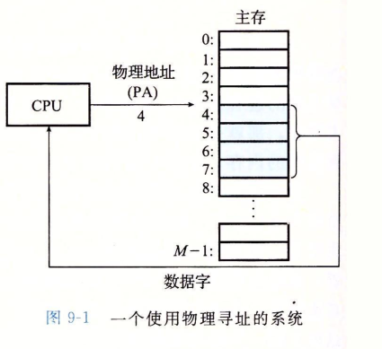
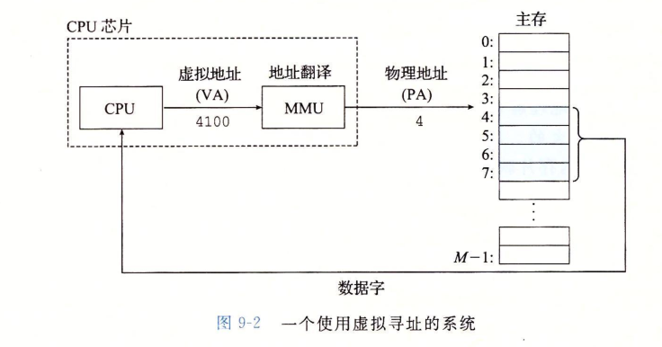

### 虚拟内存

**背景：**  
我们知道在运行一个进程的时候，需要将可执行程序加载到内存中，然后直接运行操作物理地址。而且程序在运行中对一些变量的修改，也是在修改内存中的某一个地址的值。如果程序太多，或者某几个程序对内存的消耗很大，将内存的空间使用完了，后面新的程序就无法运行了。这是一个很严重的问题。而且如果一个进程错误的操作了另一进程的空间地址，会导致另一个进程出现莫名其妙的错误。

**解决方案：**  
系统提供了一种对主存的抽象概念，就是虚拟内存（VM）。它为每一个进程都提供了一个大的，一致的，私有的地址空间。  
虚拟内存提供了三个重要的能力：  
1. 将主存看成是一个存储在磁盘上的地址空间的高速缓存，在主存中只保存活动区域，并根据需要在磁盘和主存之间进行传输数据，高效的使用主存。  
2. 为每一个进程提供一致的地址空间，简化了内存管理。  
3. 保护了每一个进程空间不被其他进程破坏。  

### 物理和虚拟寻址
计算机的主存被组织成一个有M个连续字节大小的单元组成的数组。每个字节都已一个唯一的物理地址，第一个字节的地址为0，接下来为1，再下一个为2，依次类推，最后一个为M-1。  
  
CPU直接通过这个物理地址来访问主存中的数据，这种方式是物理寻址。  

CPU通过生成虚拟地址来访问主存的方式是虚拟寻址。这个虚拟地址在被送到内存之前先转换成适当的物理地址，然后内存单元通过物理地址将访问的数据发送给CPU。这个将虚拟地址转换成物理地址的任务叫地址翻译，地址翻译需要CPU硬件和操作系统紧密结合。CPU芯片上叫内存管理单元的专用硬件，利用在主存中的查询表动态翻译虚拟地址，该表的内容由操作系统来管理。

### 地址空间

地址空间是一个非负整数地址的有序集合：{0，1，2，3，4，···}。  
地址空间的整数是连续的，这是一个线性地址空间。  
一个地址空间的大小取决于最大地址所需要的位数来描述。一般支持64位地址空间，和32位地址空间。当然，系统还有一个物理地址空间，对应于物理内存的M个字节。  
地址空间的概念很重要，它清楚的区分了数据对象和他们的属性。主存中的每一个字节都有一个选自虚拟地址空间的虚拟地址，和一个选自物理地址空间的物理地址。  

### 虚拟内存作为缓存工具

概念上来讲，虚拟内存就是一个存放在磁盘上的N个连续的字节大小的单元组成的数组。每个字节都有唯一的虚拟地址（倒数组的索引）。  
磁盘上数组的内容被缓存在主存上，VM系统通过分割成虚拟页(VP)的大小固定块，大小为P个字节。类似的物理内存被分割成物理页(PP)，大小也为P个字节。  
在任意时刻，虚拟页面分为：未分配的，缓存的，未缓存的这三种状态。

### 页表
系统要读取一个数据的时候，虚拟内存系统要判断一个虚拟页是否缓存在DRAM中的某个地方，如果是要确定在哪个物理页中，如果不命中，系统还要判断这个虚拟页存在物理磁盘的哪个地方。然后在物理内存中选择一个牺牲页并将虚拟页从磁盘中复制到DRAM中，替换掉这个虚拟页。

### 虚拟内存作为内存管理的工具
1. 简化链接，独立的地址空间允许每一个进程的内存映射使用相同的基本格式，而不管代码和数据实际的位置。  
2. 简化加载，虚拟内存还使得容易向内存中加载可执行文件和共享对象文件。  
3. 简化共享，独立的地址空间为操作系统提供一个管理用户进程和操作系统自身之间的共享一致机制。  
4. 简化内存分配，虚拟内存为向用户提供一个简单的分配额外内存的机制。  
  
### 虚拟内存可作为内存保护的工具  
不允许进程修改它的只读代码段，也不允许修改内核中的代码和数据结构，提供独立的地址空间使得区分不同进程的私有空间变得容易。

