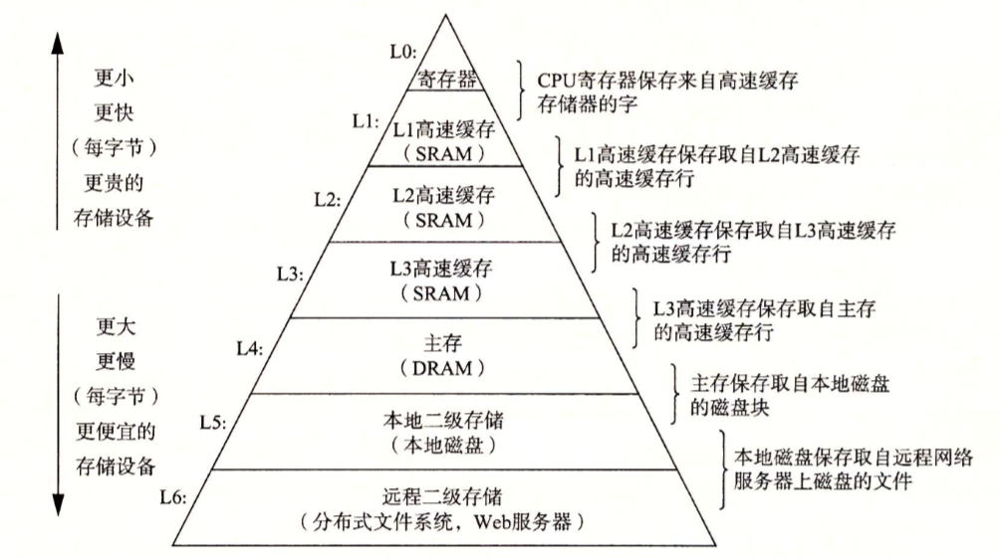
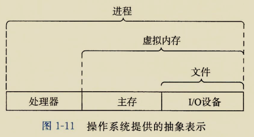

# CSAPP第一章：漫游计算机系统

什么是计算机系统？计算机系统是由硬件和系统软件组成的，它们共同工作来运行应用程序。

hello.c

----------

    #include <stdio.h>
    int mian()
    {
    printf("hello,world\n");
    return 0;
    }
    

### 信息就是位+上下文

hello程序的源程序也就是hello.c的文本文件，里面的每一个字符通过ASCII码都有一个0~255的整数与其相对应，通过这种映射关系，文本里面就是一个个整数组成，将整数转换成8位的二进制数就是0和1的位序列。文本文件就是由0和1组成的位序列，而且8个位为一组，称为一个字节，一个字节表示一个字符。这样一个文本文件最总由0和1的位序列方式存储在磁盘上。
hello.c的表示方式表明：系统中所有的信息，都是由一串比特表示的。
对于上下文的理解：单纯的比特序列，放在计算机磁盘里面，仅仅是一个比特序列，没有其他的意思，只有在特定的地方才能表示不同的意义。在文本文件里面，它是一个个字符。在二进制文件里又表示一个个机器指令。这样能能给比特序列赋予不同意义的环境就叫上下文。

### 程序编译

源程序→可执行程序的转化是由编译驱动器完成的。Linux> gcc -o hello hello.c 
编译的过程分为四个阶段：预处理器、编译器、汇编器、连接器。
预处理器(cpp)先处理#开头的语句，将头文件直接展开等。处理后生成以.i为扩展名的文件hello.i。
编译器(ccl)将文本文件hello.i文件翻译成文本文件hello.s，成为一个汇编语言的程序代码文件。
汇编器(as)将hello.s会变语言翻译成机器语言指令。将这些指令打包成一种可重定位目标程序格式。生成一个二进制文件hello.o。
连接器(ld)将我们生成的hello.o文件和标准库里面我们用到的.o文件进行合并处理，最终生成hello可执行目标文件，可以被加载到内存由系统进行运行。

### hello程序运行与硬件的关系

系统的硬件组成包括：总线    I/O设备    主存    处理器 
hello程序的运行：打开Linux终端(shell程序)，输入./hello然后回车键，hello程序就开始运行了。
从硬件的角度来看，键盘(I/O设备)通过总线接口将字符串"./hello"传输给shell程序，回车表示输入结束。shell通过一系列指令将hello可执行文件中的指令和数据从磁盘复制到主存中。之后处理器会执行hello程序中的main程序中的机器指令，这些指令会将“hello world \n”字符串的字节由主存复制到寄存器中，然后通过总线接口再由寄存器复制到显示设备，最终显示在屏幕上。

### 高速缓存的重要性

在hello程序运行的过程中，系统花费了大量的时间用于信息的复制(从一个地方复制到另一个地方)。这些复制就是开销，为了使这些复制操作尽快的完成，是程序设计者的主要目标。  
存储设备从小到大可分为 寄存器 SRAM DRAM 本地磁盘 服务器，当让价格也是由昂贵到便宜。其中SRAM就是高速缓存。

L0寄存器是处理器直接读取使用的一块，这个能存放的数据很小，但是速度特别快，当然单比特造价也是很昂贵的。  
L1~L3就是我们熟悉的三级缓存，高速缓存存放着处理器即将要使用的数据，在处理器需要的时候，以最快的速度将数据传输到寄存器中。  
L4是主存，也就是我们电脑中的内存条，容量相对较大，但是和硬盘比起来还是小太多了，根据市场上内存条的价格和硬盘的价格你就可以知道单个比特造价的差异了。  
L5就是我们的硬盘了，现在市场上由ssd和hhd，固态硬盘和机械硬盘。固态硬盘要比机械硬盘速度快，当然也更昂贵一些。这里注意一个特点：L0~L4都是断电即丢失数据，L5断电可以保存数据，前面都是帮助系统更快更好的运行的，硬盘才是存储数据的地方。   
L6这个就是远程服务器了，我的觉得网盘也算吧，不过速度确实太慢了。

### 操作系统管理硬件

所有的应用程序在进行对硬件的操作尝试都必须经过操作系统，而不能直接读底层硬件进行操作。
操作系统的两个功能：(1)防止硬件被失控的应用程序滥用。(2)向应用程序提供简单一致的机制来控制复杂而又大不相同的低级硬件设备。 操作系统通过抽象概念(进程、虚拟内存、文件)来进行实现这两个功能。

### 进程

进程是操作系统对一个正在运行的程序的一种抽象。一个系统可以同时运行多个进程，但是从进程的内部来看，就好像是独占着处理器，内存已经各种硬件。对于CPU来说，这样的并发操作是由处理器在各个进程之间频繁的切换执行实现的。这种进程间的切换被称为上下文切换。进程在被切换的时候，会保存当前进程的状态信息也就是上下文，然后回复要新的进程的上下文，开始运行新的进程。
进程与进程之间是并机的，进程中间又包含线程，也是一种并发运行的机制，一个进程的上线文对每个线程来说的是共享的，同事效率也更高。

### 虚拟内存

虚拟内存这个抽象让每个进程都觉得自己在独占着整个主存。每个进程看到的内存都是一致的。虚拟地址空间又被分成了还几个区域。
程序代码和数据区： 程序和一些全局变量等，按照可执行目标文件来初始化的。
堆区：当程序调用malloc和free这样的库函数的时候，堆大小进行收缩。
共享库： 存放C标准库和数学库等共享库的代码和数据。
栈： 我们进行函数调用和函数退出的时候，栈空间进行扩展和收缩。
内核虚拟内存：不允许应用程序进行着区域的内容读写。应用程序必须调用内核提供的接口来进行操作。

### 文件

Linux系统中  一切皆文件 。

### 系统间的网络通信

网络可以看做是一个IO设备，当然一个设备也可以看做一个文件，当两个系统通过网络连接一起的时候，我们就可以通过对网络设备文件读写的方式进行网络通信。

### 重要概念

**并发**：指一个同时具有多个活动的系统。  
**并行**：用并发来使一个系统运行的更快。  
**多核处理器**：讲多个CPU集成到一个集成电路芯片上。  
**超线程**：是一个允许一个CPU执行对个控制流的技术。  
**超标量处理器**：处理器可以达到比一个周期一条指令更快的执行效率。    
**单指令多数据并行**：处理器用用特殊的硬件，允许一条指令产生多个可以并行指令的操作。

