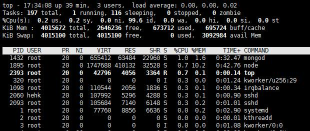
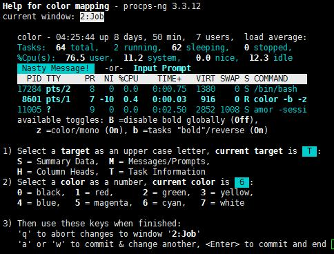

## shell命令------top总结  

前几天调程序性能的时候使用到了top这个命令，觉得从这个命令中，我们能看到很多信息。top的功能也是很强大的，之前一直不了解，只是简单的使用top命令显示进程信息，接下就学一学top命令的详细用法。  

### **最基本的使用方法：** 

在Linux终端窗口上输入top命令：

    root@hehk:~# top  

按下回车键之后会弹出一个实时刷新的列表如下图：  

  

然后我们看看显示的都是些什么东西：  
**第一行**：

top|命令
---|---  
17:34:08 |系统时间
39min |当前系统运行时长
3 user |用户数目
load average|平均负载

**系统时间** 对于我们来说用处不大，我们可以使用date命令获取更详细的时间  
**当前系统运行时长** 可以通过这个时间来推断我们的系统启动的时间。如果是服务器的话，就可知道上次重启的时间。  
**用户数** 可以知道当前有几个用户的程序在运行。  
**平均负载** 这个相对来说是比较重要的指标了，从图中我们可以看到后面有三个数字，第一个是最近1分钟内的平均负载，第二个是最近5分钟的平均负载，第三个是最近15分钟的平均负载。  
平局负载的常用分析方法：  
load average数据是每隔5秒钟检查一次活跃的进程数，然后按特定算法计算出的数值。如果这个数除以逻辑CPU的数量，结果高于5的时候就表明系统在超负荷运转了。  
如果发现一分钟内的平均负载很大，五分钟内的平均负载较小，十五分钟内的平均负载很小，说明一分钟到五分钟内有程序出现异常，导致负载过大。  

**第二行**：  

tasks|任务相关
---|---
197 total|总进程个数
1 running|运行状态进程数
116 sleeping|睡眠状态进程数
0 stopped|停止状态进程数
0 zombie|僵尸进程数

这一行都是任务相关的东西，从不同的状态的数目分析，我们可以知道整个系统进程的运行情况。这里面的僵尸进程的数目一般为0，如果发现不为0，而且数量还很多的时候，很有可能是代码中子进程退出的时候，父进程没有做回收资源，导致子进程一直处于僵尸进程状态。这时候我们要查看一下僵尸进程的pid和ppid来判断是父进程是谁，然后在代码中定位。  

**第三行**：  

%CPU(s)|cpu使用百分比
---|---
0.2 us|用户空间占用CPU的百分比
0.2 sy|内核空间占用CPU的百分比
0.0 ni|改变过优先级的进程占用CPU的百分比
99.6 id|空闲CPU百分比
0.0 wa|IO等待占用CPU的百分比
0.0 hi|硬中断（Hardware IRQ）占用CPU的百分比
0.0 si|软中断（Software Interrupts）占用CPU的百分比
0.0 st|窃取时间占用CPU百分比

这一行是关于CPU状态的，我么你可以清楚的看到CPU的状态情况，cpu占用较高的进程需要重点关注一下了。  

**第四行**

KiB Mem |内存状态信息(kib为单位)
---|---
total|物理内存总量
free|空闲内存总量
used|使用中的内存总量
buff/cache|缓存的内存量  

当一个进程运行一段试讲就挂掉，我们就需要注意一下这一行，有可能是程序OOM(out of memory)了，当空闲内存容量等于0的时候，系统会杀掉一些进程来保证内存可用，一般情况是优先杀掉内存占用高的进程。  

**第五行**

KiB Swap|swap交换分区信息
---|---
total|交换区总量
free|空闲交换区总量
used|使用的交换区总量
avail Mem|有效内存容量
  

**主要列表**

---|---
PID|进程的ID号，简称PID是进程的唯一标识
USER|进程所属用户
PR|进程的优先级
NI|nice值---负值表示高优先级，正值表示低优先级
VIRT|进程使用的虚拟内存总量 =swap+res
RES|进程使用的、未被换出的物理内存大小 =code+data
SHR|共享内存大小
S|进程状态。D=不可中断的睡眠状态 R=运行 S=睡眠 T=跟踪/停止 Z=僵尸进程
%CPU|上次更新到现在的CPU时间占用百分比
%MEM|进程使用的物理内存百分比
TIME+|进程使用的CPU时间总计，单位1/100秒
COMMAND| 进程名称（命令名/命令行）

OK整个top命令的界面我们介绍完了，我们可以通过主表中找到我们自己的进程，分析进程的各项指标来了解自己项目代码的运行状态。

### **进阶-top参数的使用方法**

#### <1> top + 参数

**$ 版本信息**  

    top -v  
    top -h
	### 这两个命令的功能是一样的，都是输出top的版本信息。  

**$ 刷新时间**

    top -d num  
	### -d的参数后面必须加时间，以秒为单位。然后界面以设定的时间刷新。 
	top -s   
	### -s 后面不能加参数 默认为5秒。然后界面以5秒时间刷新。

**$ 指定刷新次数**

	top -n num
	### 后面的num就是刷新的次数，比如 `top -n 5` 界面就会刷新5次后退出。

**$ 显示某个用户下的进程**

	top -u username
	### 会显示我们指定用户下的进程状态。

**$ 显示指定的进程信息**

	top -p pid  
	### pid 就是我么指定进程的pid号。

**$ 显示完整用户名/命令**

	top -c

**$ 以积累模式显示程序信息**

	top -S

**$ 关闭交互式指令**

	top -s
	### 交互式指令不能使用了

**$ 以批处理模式显示程序信息**

	top -b
	### 刷屏打印程序信息，比较适合输入日志文件。

**$ 隐藏空闲的任务**

	top -i

**$ 按照某种属性排序**

	top -O
	### 这个可以打印出可排序的属性列列表
	top -o  columns
	### 例如 top -o %CPU 就可以按照CPU使用率来排序显示

**一般这种命令直接加参数的形式使用的较少，通常使用交互式命令比较多。**

#### <2> top 交互 

**显示帮助页面**

h和？都可以进帮助页面，这里面介绍了很多交互命令，有不懂的可以直接按h来获得帮助。  
下面我就简单介绍几个有意思的和有用的交互命令。

**改变主题颜色** 

按下小z，我们发现界面颜色变了，再按一下小z就会还原，一般默认的颜色是红色。可以按大Z进入设置界面如下：
  
  

- S M H T 来选择要设置的目标区域  
- 0-7 八种颜色主题可以选择预览  
- q或enter 返回保存当前设置的颜色主题
- a或w可以切换主题

**高亮主排序的列**

按下小x会发现有一列高亮，默认是cpu的列，因为默认是按CPU使用率排序的，我们可以按shift+<或shift+> 进行排序列的切换，这个功能很方便，也很常用。  

**CPU的使用情况**

数字1可以将CPU展开，显示每一个CPU的使用情况。
t可以用进度条的形式显示CPU的使用情况。

**内存的使用情况**

m可以让内存的状态，以进度条的形式显示。

**其他常用交互命令**

	Ctrl+L   擦除并且重写屏幕。 
	h或者?    显示帮助画面，给出一些简短的命令总结说明。 
	k        终止一个进程。系统将提示用户输入需要终止的进程PID，以及需要发送给该进程什么样的信号。一般的终止进程可以使用15信号；如果不能正常结束那就使用信号9强制结束该进程。默认值是信号15。在安全模式中此命令被屏蔽。 
	i        忽略闲置和僵死进程。这是一个开关式命令。 
	q        退出程序。 
	r        重新安排一个进程的优先级别。系统提示用户输入需要改变的进程PID以及需要设置的进程优先级值。输入一个正值将使优先级降低，反之则可以使该进程拥有更高的优先权。默认值是10。 
	S        切换到累计模式。 
	s        改变两次刷新之间的延迟时间。系统将提示用户输入新的时间，单位为s。如果有小数，就换算成m s。输入0值则系统将不断刷新，默认值是5 s。需要注意的是如果设置太小的时间，很可能会引起不断刷新，从而根本来不及看清显示的情况，而且系统负载也会大大增加。 
	f或者F    从当前显示中添加或者删除项目。 
	o或者O    改变显示项目的顺序。 
	l        切换显示平均负载和启动时间信息。 
	m        切换显示内存信息。 
	t        切换显示进程和CPU状态信息。 
	c        切换显示命令名称和完整命令行。 
	M        根据驻留内存大小进行排序。 
	P        根据CPU使用百分比大小进行排序。 
	T        根据时间/累计时间进行排序。 
	W        将当前设置写入~/.toprc文件中。这是写top配置文件的推荐方法。